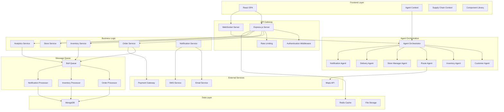
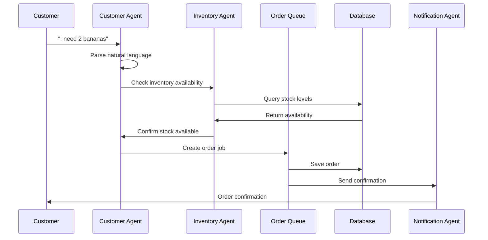
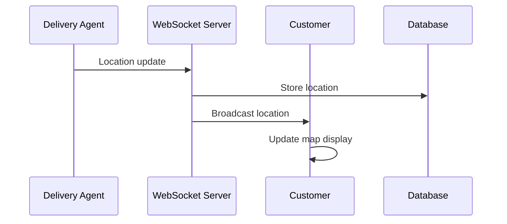
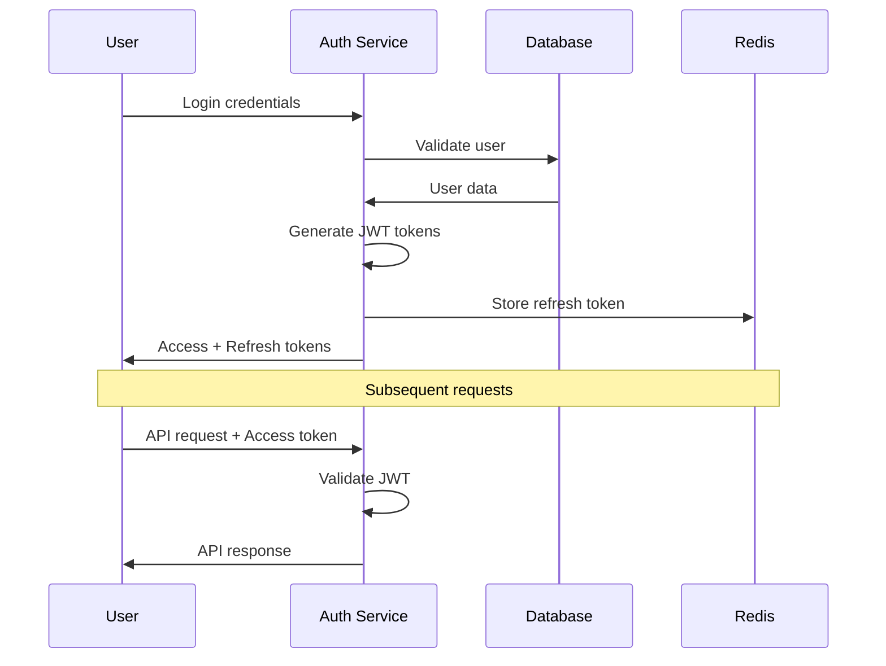
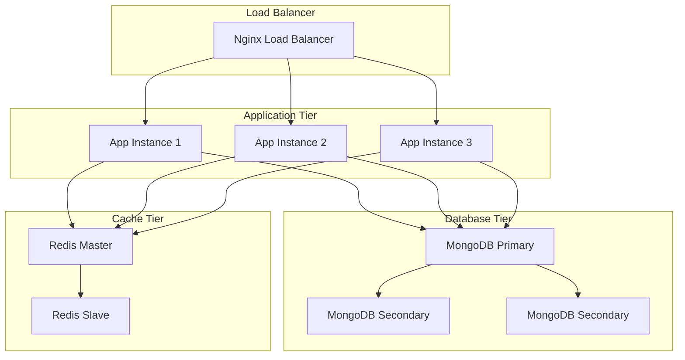
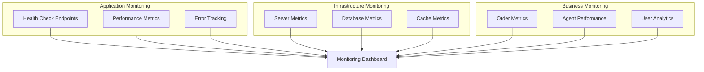
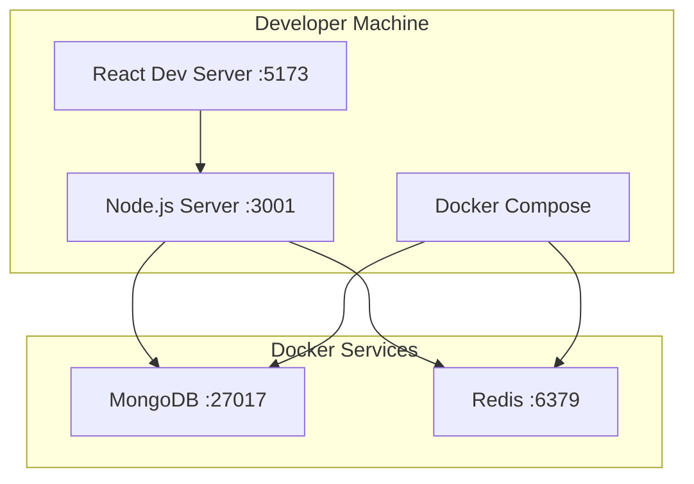
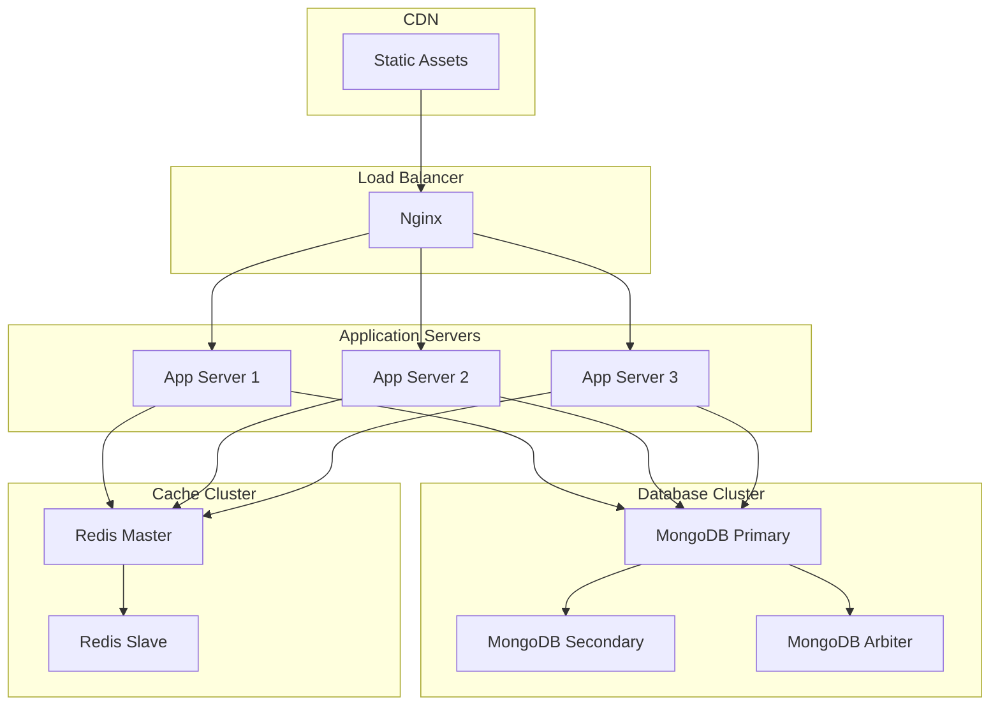
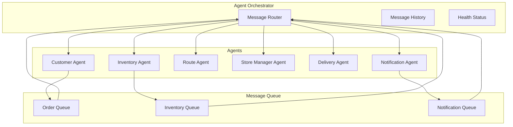

# System Architecture

## Overview
The AI Supply Chain Command Center is built using a modern, scalable architecture that combines React frontend, Node.js backend, and AI agent orchestration using LangGraph.

## Architecture Diagram



## Technology Stack

### Frontend
- **Framework**: React 18 with TypeScript
- **Routing**: React Router v6
- **State Management**: Context API with useReducer
- **Styling**: Tailwind CSS
- **Icons**: Lucide React
- **Charts**: Recharts
- **Animations**: Framer Motion
- **Build Tool**: Vite

### Backend
- **Runtime**: Node.js 18+
- **Framework**: Express.js
- **WebSockets**: Socket.IO
- **Authentication**: JWT with refresh tokens
- **Validation**: Joi + express-validator
- **Security**: Helmet, CORS, Rate limiting
- **Logging**: Winston

### Database
- **Primary Database**: MongoDB with Mongoose ODM
- **Cache**: Redis
- **Message Queue**: Bull (Redis-based)

### AI/ML
- **Agent Framework**: LangGraph
- **Natural Language Processing**: Custom NLP with pattern matching
- **State Management**: Zod schemas for type safety

### DevOps
- **Containerization**: Docker & Docker Compose
- **Reverse Proxy**: Nginx
- **Process Management**: PM2
- **Monitoring**: Custom health checks

## Component Architecture

### Frontend Components

```
src/
├── components/
│   ├── Dashboard.tsx              # Main dashboard
│   ├── CustomerPortal.tsx         # Customer interface
│   ├── StoreManagerDashboard.tsx  # Store management
│   ├── DeliveryAgentApp.tsx       # Delivery interface
│   ├── InventoryAgent.tsx         # Inventory management
│   ├── RouteOptimization.tsx      # Route planning
│   └── AgentCommunication.tsx     # Agent messaging
├── context/
│   ├── SupplyChainContext.tsx     # Global state management
│   └── AgentContext.tsx           # Agent orchestration
├── agents/
│   ├── AgentOrchestrator.ts       # Main orchestrator
│   ├── BaseAgent.ts               # Abstract base class
│   ├── CustomerAgent.ts           # Customer service agent
│   ├── InventoryAgent.ts          # Inventory management
│   ├── RouteAgent.ts              # Route optimization
│   └── types.ts                   # Type definitions
└── App.tsx                        # Main application
```

### Backend Services

```
server/src/
├── routes/
│   ├── auth.js                    # Authentication endpoints
│   ├── orders.js                  # Order management
│   ├── inventory.js               # Inventory operations
│   ├── stores.js                  # Store management
│   ├── agents.js                  # Agent communication
│   └── analytics.js               # Analytics endpoints
├── models/
│   ├── User.js                    # User schema
│   ├── Order.js                   # Order schema
│   ├── Inventory.js               # Inventory schema
│   └── Store.js                   # Store schema
├── middleware/
│   ├── auth.js                    # Authentication middleware
│   ├── validation.js              # Input validation
│   └── errorHandler.js            # Error handling
├── workers/
│   ├── orderProcessor.js          # Order processing
│   ├── inventoryProcessor.js      # Inventory updates
│   └── notificationProcessor.js   # Notifications
├── config/
│   ├── database.js                # MongoDB configuration
│   ├── redis.js                   # Redis configuration
│   └── queues.js                  # Message queue setup
├── sockets/
│   └── socketHandlers.js          # WebSocket event handlers
└── server.js                      # Main server file
```

## Data Flow

### Order Processing Flow



### Real-time Updates Flow



## Security Architecture

### Authentication Flow



### Security Layers

1. **Network Security**
   - HTTPS/TLS encryption
   - CORS configuration
   - Rate limiting
   - Request size limits

2. **Authentication & Authorization**
   - JWT access tokens (15 min expiry)
   - Refresh tokens (7 day expiry)
   - Role-based access control
   - Session management

3. **Data Security**
   - Input validation & sanitization
   - XSS protection
   - CSRF protection
   - SQL injection prevention
   - Password hashing (bcrypt)

4. **API Security**
   - Request throttling
   - Security headers
   - API versioning
   - Error message sanitization

## Scalability Considerations

### Horizontal Scaling



### Performance Optimization

1. **Database Optimization**
   - Proper indexing strategy
   - Connection pooling
   - Query optimization
   - Data aggregation pipelines

2. **Caching Strategy**
   - Redis for session storage
   - Query result caching
   - Static asset caching
   - CDN integration

3. **Application Optimization**
   - Lazy loading
   - Code splitting
   - Bundle optimization
   - Image optimization

## Monitoring & Observability

### Health Monitoring



### Logging Strategy

1. **Application Logs**
   - Request/response logging
   - Error logging with stack traces
   - Performance metrics
   - Security events

2. **Business Logs**
   - Order lifecycle events
   - Inventory changes
   - Agent communications
   - User actions

3. **System Logs**
   - Database operations
   - Cache operations
   - Queue processing
   - WebSocket connections

## Deployment Architecture

### Development Environment



### Production Environment



## Agent System Architecture

### Agent Communication Pattern



### State Management

Each agent maintains its own state using Zod schemas for type safety:

```typescript
// Agent State Schema Example
const CustomerAgentStateSchema = z.object({
  currentOrder: OrderSchema.optional(),
  customerPreferences: z.record(z.any()).default({}),
  conversationHistory: z.array(z.object({
    role: z.enum(['user', 'assistant']),
    content: z.string(),
    timestamp: z.date()
  })).default([])
});
```

This architecture ensures scalability, maintainability, and robust performance for the AI Supply Chain Command Center.